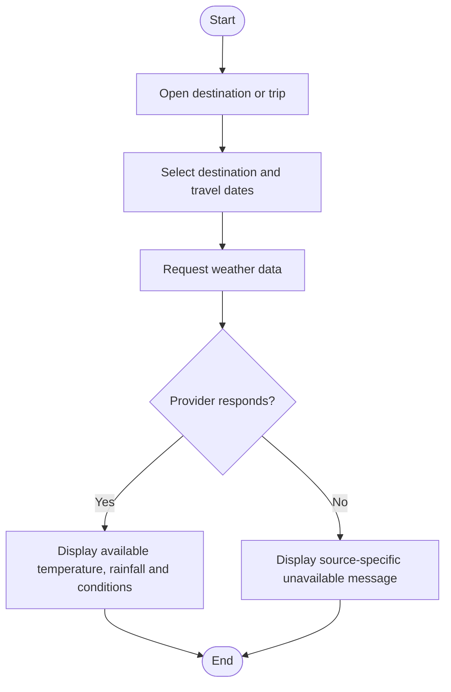
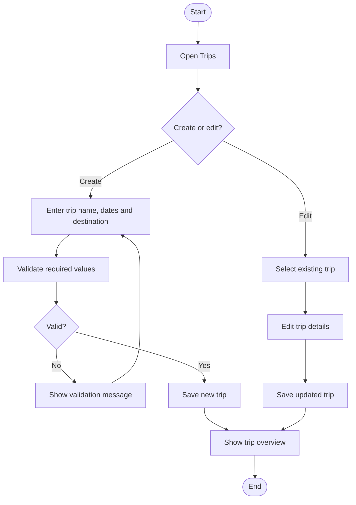
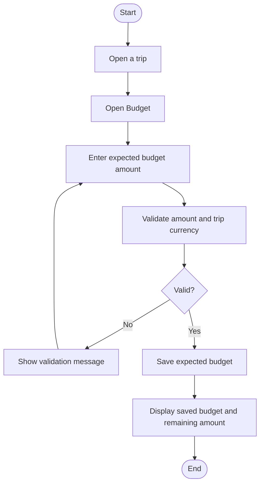

# FR-4 — View Weather

**Related requirement:** FR-4

```mermaid
flowchart TD
    A([Start]) --> B[Open destination or trip]
    B --> C[Select destination and travel dates]
    C --> D[Request weather data]
    D --> E{Provider responds?}
    E -- Yes --> F[Display available temperature, rainfall and conditions]
    E -- No --> G[Display source-specific unavailable message]
    F --> H([End])
    G --> H
```

# FR-5 — Create and Maintain a Trip

**Related requirement:** FR-5

```mermaid
flowchart TD
    A([Start]) --> B[Open Trips]
    B --> C{Create or edit?}
    C -- Create --> D[Enter trip name, dates and destination]
    D --> E[Validate required values]
    E --> F{Valid?}
    F -- No --> G[Show validation message]
    G --> D
    F -- Yes --> H[Save new trip]
    C -- Edit --> I[Select existing trip]
    I --> J[Edit trip details]
    J --> K[Save updated trip]
    H --> L[Show trip overview]
    K --> L
    L --> M([End])
```
# FR-6 — Set a Budget for Each Trip

**Related requirement:** FR-6

```mermaid
flowchart TD
    A([Start]) --> B[Open a trip]
    B --> C[Open Budget]
    C --> D[Enter expected budget amount]
    D --> E[Validate amount and trip currency]
    E --> F{Valid?}
    F -- No --> G[Show validation message]
    G --> D
    F -- Yes --> H[Save expected budget]
    H --> I[Display saved budget and remaining amount]
    I --> J([End])
```
