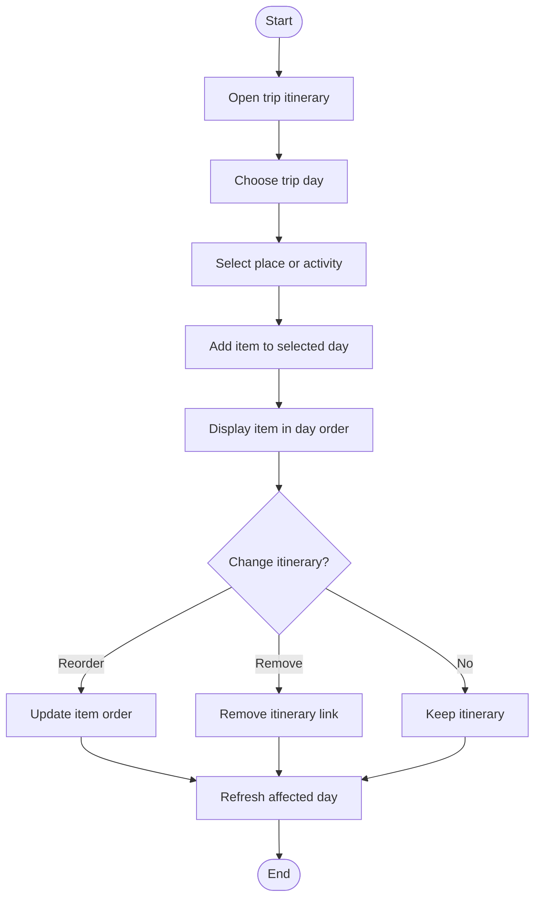
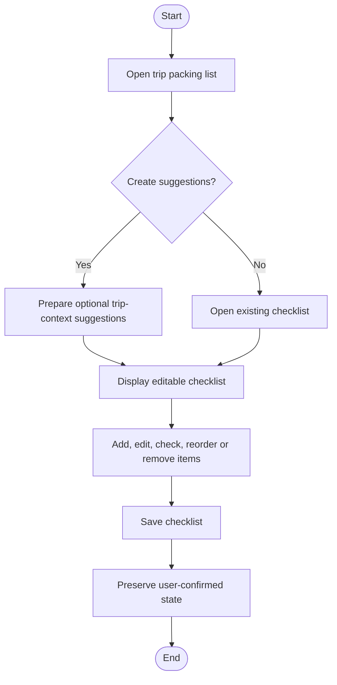

# FR-7 — Organize an Itinerary by Trip Day

**Related requirement:** FR-7

```mermaid
flowchart TD
    A([Start]) --> B[Open trip itinerary]
    B --> C[Choose trip day]
    C --> D[Select place or activity]
    D --> E[Add item to selected day]
    E --> F[Display item in day order]
    F --> G{Change itinerary?}
    G -- Reorder --> H[Update item order]
    G -- Remove --> I[Remove itinerary link]
    G -- No --> J[Keep itinerary]
    H --> K[Refresh affected day]
    I --> K
    J --> K
    K --> L([End])
```

# FR-8 — Prepare and Maintain a Packing Checklist

**Related requirement:** FR-8

```mermaid
flowchart TD
    A([Start]) --> B[Open trip packing list]
    B --> C{Create suggestions?}
    C -- Yes --> D[Prepare optional trip-context suggestions]
    C -- No --> E[Open existing checklist]
    D --> F[Display editable checklist]
    E --> F
    F --> G[Add, edit, check, reorder or remove items]
    G --> H[Save checklist]
    H --> I[Preserve user-confirmed state]
    I --> J([End])
```
