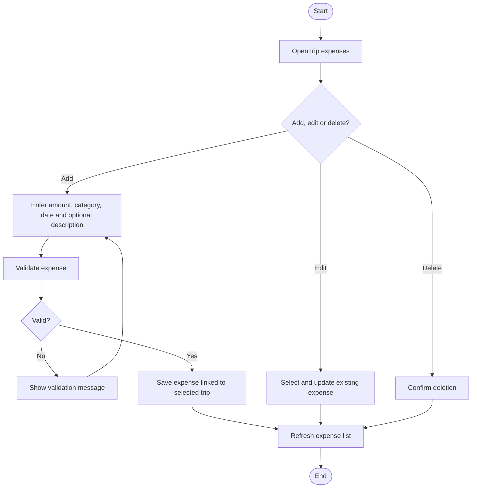
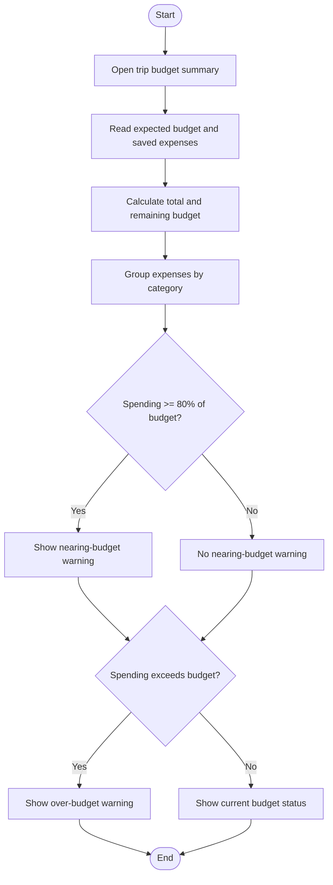

# FR-9 — Record and Manage Expenses

**Related requirement:** FR-9

```mermaid
flowchart TD
    A([Start]) --> B[Open trip expenses]
    B --> C{Add, edit or delete?}
    C -- Add --> D[Enter amount, category, date and optional description]
    D --> E[Validate expense]
    E --> F{Valid?}
    F -- No --> G[Show validation message]
    G --> D
    F -- Yes --> H[Save expense linked to selected trip]
    C -- Edit --> I[Select and update existing expense]
    C -- Delete --> J[Confirm deletion]
    H --> K[Refresh expense list]
    I --> K
    J --> K
    K --> L([End])
```

# FR-10 — View Expense Summary, Status and Warning

**Related requirement:** FR-10

```mermaid
flowchart TD
    A([Start]) --> B[Open trip budget summary]
    B --> C[Read expected budget and saved expenses]
    C --> D[Calculate total and remaining budget]
    D --> E[Group expenses by category]
    E --> F{Spending >= 80% of budget?}
    F -- Yes --> G[Show nearing-budget warning]
    F -- No --> H[No nearing-budget warning]
    G --> I{Spending exceeds budget?}
    H --> I
    I -- Yes --> J[Show over-budget warning]
    I -- No --> K[Show current budget status]
    J --> L([End])
    K --> L
```
