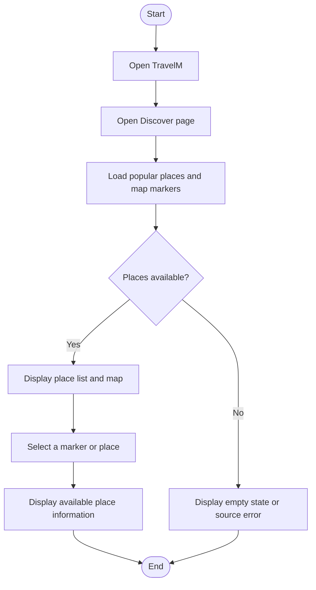
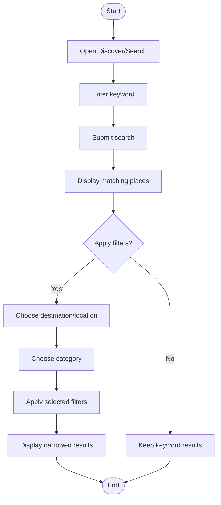
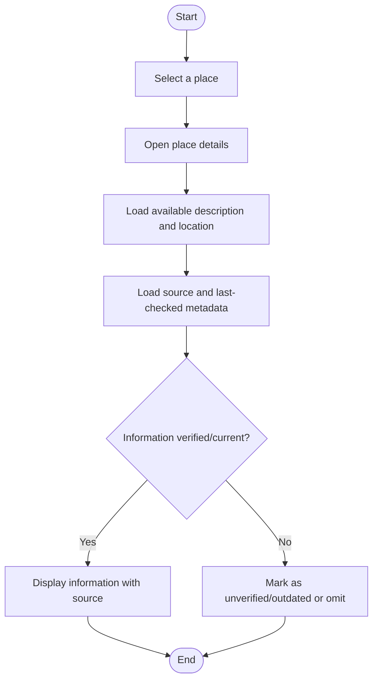

# FR-1 — Discover Places

```mermaid
flowchart TD
    A([Start]) --> B[Open TravelM]
    B --> C[Open Discover page]
    C --> D[Load popular places and map markers]
    D --> E{Places available?}
    E -- Yes --> F[Display place list and map]
    F --> G[Select a marker or place]
    G --> H[Display available place information]
    H --> I([End])
    E -- No --> J[Display empty state or source error]
    J --> I
```

# FR-2 — Search and Filter Places

**Related requirement:** FR-2

```mermaid
flowchart TD
    A([Start]) --> B[Open Discover/Search]
    B --> C[Enter keyword]
    C --> D[Submit search]
    D --> E[Display matching places]
    E --> F{Apply filters?}
    F -- Yes --> G[Choose destination/location]
    G --> H[Choose category]
    H --> I[Apply selected filters]
    I --> J[Display narrowed results]
    F -- No --> K[Keep keyword results]
    J --> L([End])
    K --> L
```

# FR-3 — View Accurate and Sourced Place Information

**Related requirement:** FR-3

```mermaid
flowchart TD
    A([Start]) --> B[Select a place]
    B --> C[Open place details]
    C --> D[Load available description and location]
    D --> E[Load source and last-checked metadata]
    E --> F{Information verified/current?}
    F -- Yes --> G[Display information with source]
    F -- No --> H[Mark as unverified/outdated or omit]
    G --> I([End])
    H --> I
```
